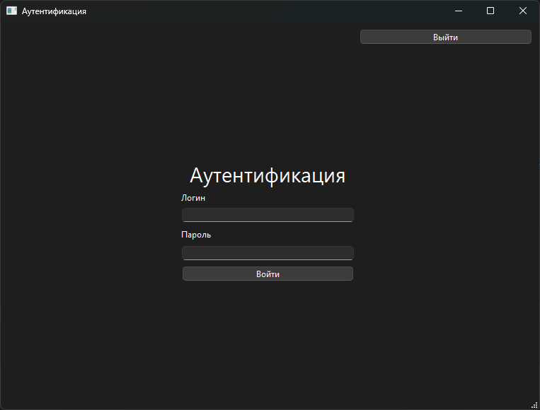

# Приложение ПРБ
## Настольное приложение

Главный файл [main.py](main.py)

### Интерфейс настольного приложения



```python
class BedsWindow:
    def __init__(self):
        super().__init__()
```


```bash
python main.py
```


1. [x] ### шгнцпунгр г**_[шр нгпг ппщн8п ншщр]()_** 9ор9щр щрзг   

уцкмшгцукромщгку 